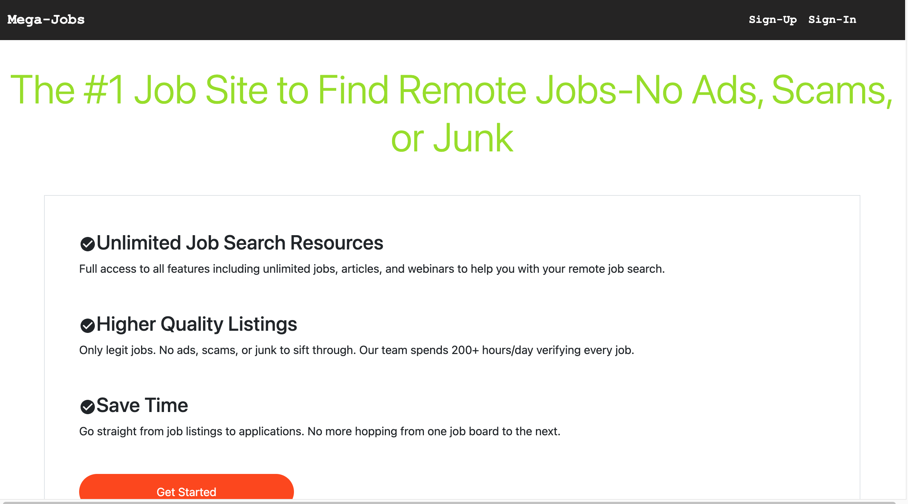
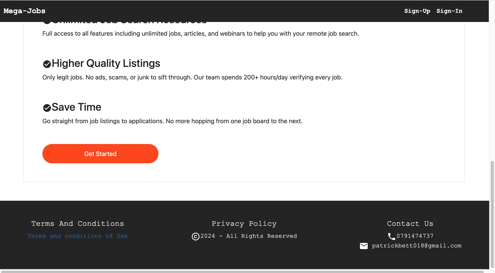
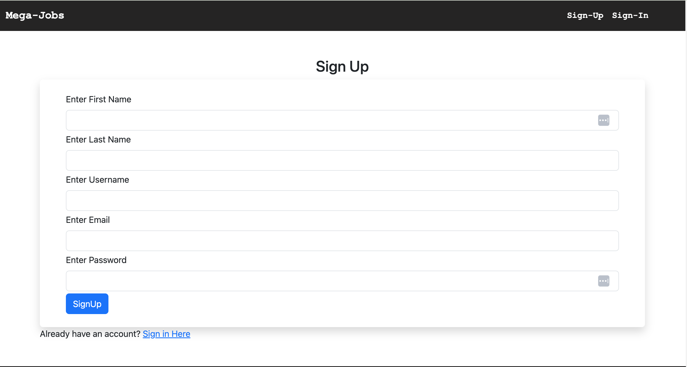
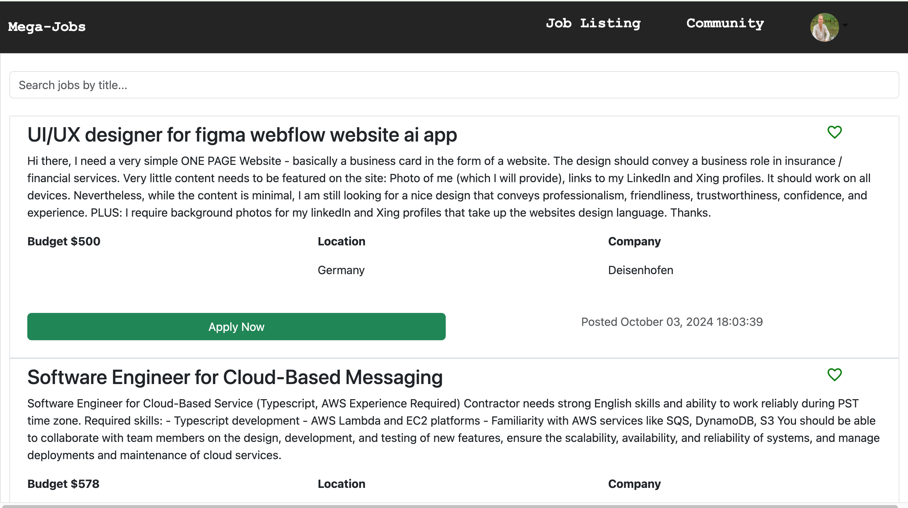
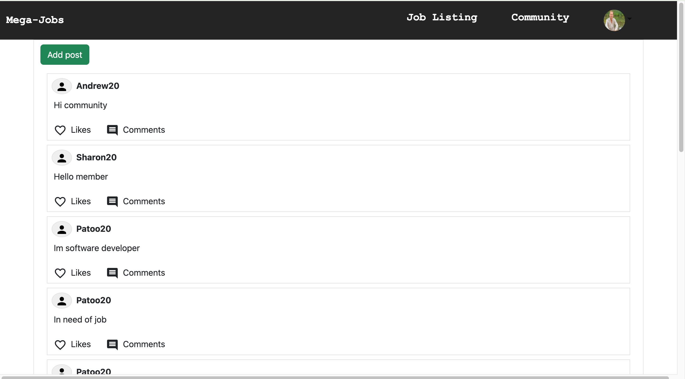
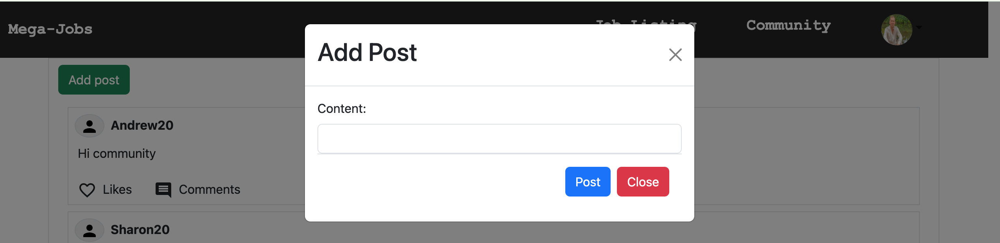
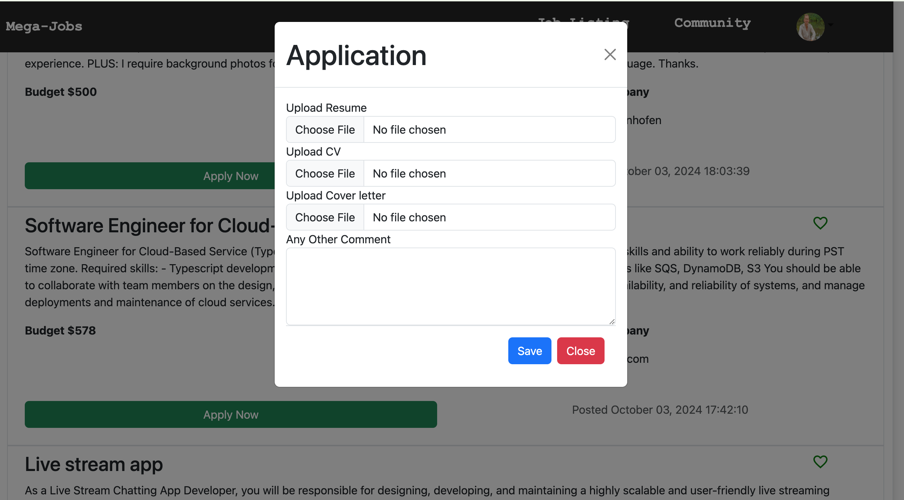

# Mega Jobs

Welcome to Mega Jobs, a comprehensive platform designed for job seekers and employers looking to connect in the realm of remote work. With features like job listings and community interactions, Mega Jobs aims to enhance your job-seeking experience.

## Table of Contents

- [Features](#features)
- [Technologies Used](#technologies-used)
- [Installation](#installation)
- [Usage](#usage)
- [API Integration](#api-integration)


## Features

### User Authentication
- **Sign Up:** New users can create an account to access the platform.
- **Sign In:** Existing users can log in securely to their accounts.

### Job Listings
- **Browse Remote Jobs:** Users can view a list of jobs posted by various employers.
- **Job Details:** Each job listing includes details such as job title, description, budget, location, and company.

### Community Interaction
- **Discussion Forum:** Users can interact with each other in a community section, sharing experiences and insights related to job seeking and remote work.
- **Post Creation:** Users can create posts to share their thoughts or seek advice from fellow community members.

### Application Submission
- **Apply for Jobs:** Users can apply for jobs by submitting their CVs, resumes, and cover letters directly through the platform.

## Technologies Used

- **Frontend:** React
- **Backend:** Django (REST API)
- **Database:** (Specify your database, e.g., PostgreSQL, SQLite)
- **Styling:** Bootstrap for responsive design
- **Authentication:** JWT (JSON Web Tokens)

## Installation

To run Mega Jobs locally, follow these steps:

1. **Clone the Repository:**
   ```bash
   git clone https://github.com/yourusername/mega-jobs.git
   cd mega-jobs
   npm install
   npm start
   Access the Application: Open your browser and navigate to http://localhost:3000 to view the application.


## Usage

- **Sign Up**: Create a new account using the sign-up feature.
- **Sign In**: Log in to access your dashboard.
- **Browse Jobs**: Explore the job listings available in your area of interest.
- **Community**: Engage with other users in the community section.
- **Apply for Jobs**: Submit your applications by uploading your CV, resume, and cover letter.

## API Integration

Mega Jobs connects to a Django backend API to fetch and post data. The key API endpoints include:

- **GET /api/jobs/**: Retrieve a list of job postings.
- **POST /api/application/**: Submit an application with CV and cover letter.
- **GET /api/posts/**: Fetch community posts.
- **POST /api/posts/**: Create a new community post.












